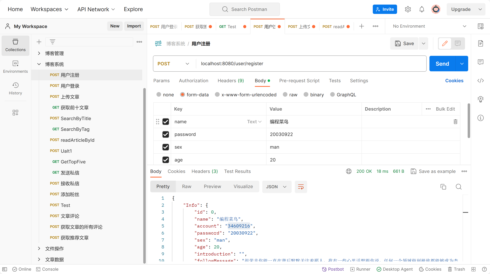

# BlogSystem

## 项目简介

​	本博客系统项目属于**Go后端入门练手项目**，主要目的是巩固最近所学的gin、gorm 知识，基于这两个基础技术栈实现博客系统的基本业务逻辑，故本项目适合作为go后端学习者的参考学习项目，有意愿者可以基于本项目做出更多拓展！出于练习的目的，本博客系统的功能并不全面，但是无伤大雅，只要达到练习目的就足够了。

---


## 项目相关工具

编译器: go 2022.2

数据库：mysql、redis(redis服务由docker容器提供)

测试软件：postman



## 功能模块

​	本项目被划分为五个模块，具体的模块功能实现详情参考internal/api目录的api.go文件，该文件用于组织controller层面的api接口。很显然，本项目按照功能模块进行路由分组管理，项目的大体功能模块框架在此处一目了然，具体而言分为如下模块：

**用户模块**

​	此模块提供用户注册、用户登录两个路由处理函数。前者在postman中输入注册信息，检验成功后，注册信息被插入数据库；后者输入已注册用户的账号与密码，成功登陆后生成一串token字符串，用于后续功能的检验信息。


**文章模块**

​	该模块提供上传文章、获取阅读量排名前十文章、获取排名前五文章（根据文章标签）三个路由处理函数.功能详情可参考函数的具体实现代码，主要涉及数据绑定、业务信息的处理以及插入数据库等操作.


**用户文章交互模块**

​	在api.go文件中，UaIt是User Article Iteraction的缩写。该模块提供了七个用户文章交互的路由处理函数，具体功能名称可见路由分支的代码注释，功能实现见具体实现代码，如下图所示：

```go
	// 1.按照文章标题搜索文章列表
	UaIt.POST("/searchByTitle", controller.SearchArticleByTitle, logic.OutputArticleByMode())
```


**用户交互模块**

​	具体功能详情获悉参考同上…


**消息管理模块**

​	该模块包括发送私信以及获取私信两个功能函数，它所涉及的函数同时起到协助其他功能模块实现的作用，比如在用户交互模块，当你关注别人之后，别人会给你发送一条感谢信，便调用了本模块的功能函数.


